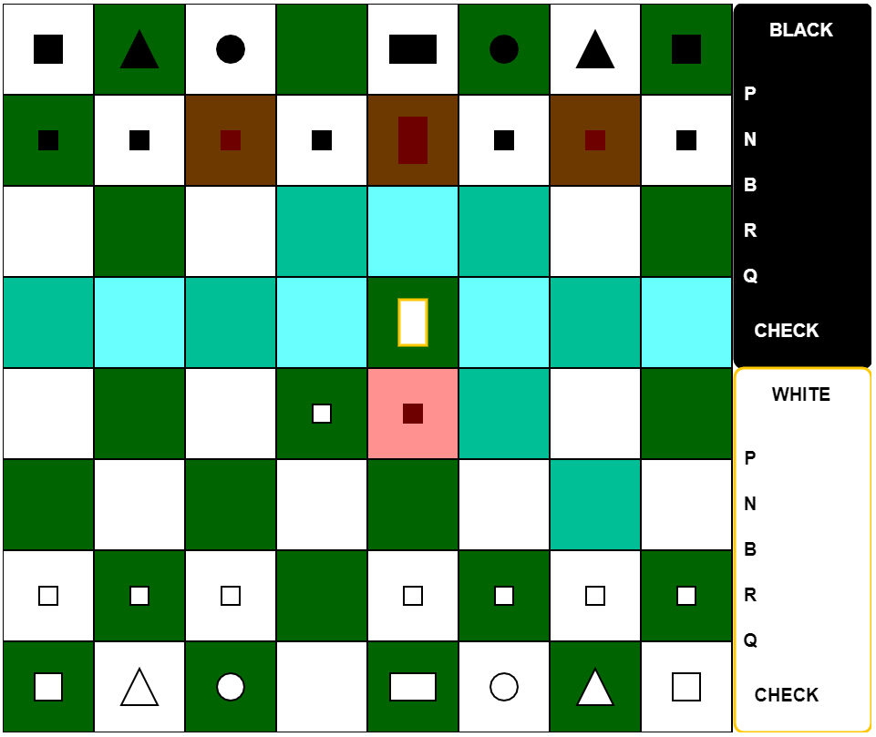
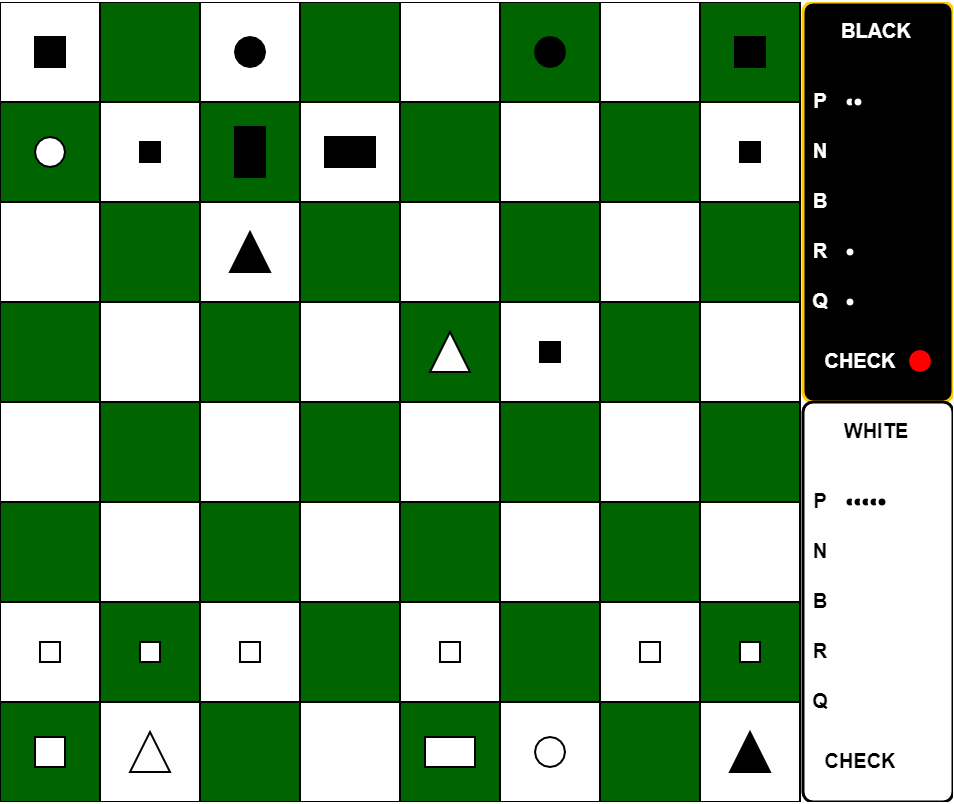

# CHESS in p5.js
This project is a game of chess written in JavaScript using the p5.js library  
[Game Link](https://mayukh-g.github.io/ChessFromScratch/)

### Features being worked on
- [x] [Movement](#move)
- [x] Checks
- [x] Captures
- [x] Board
- [x] [Sideboard](#sideboard)
- [x] Checkmates
- [ ] Special moves (castle, en-passant)
- [ ] More distinct Pieces

Move
---
  

Sideboard
---

